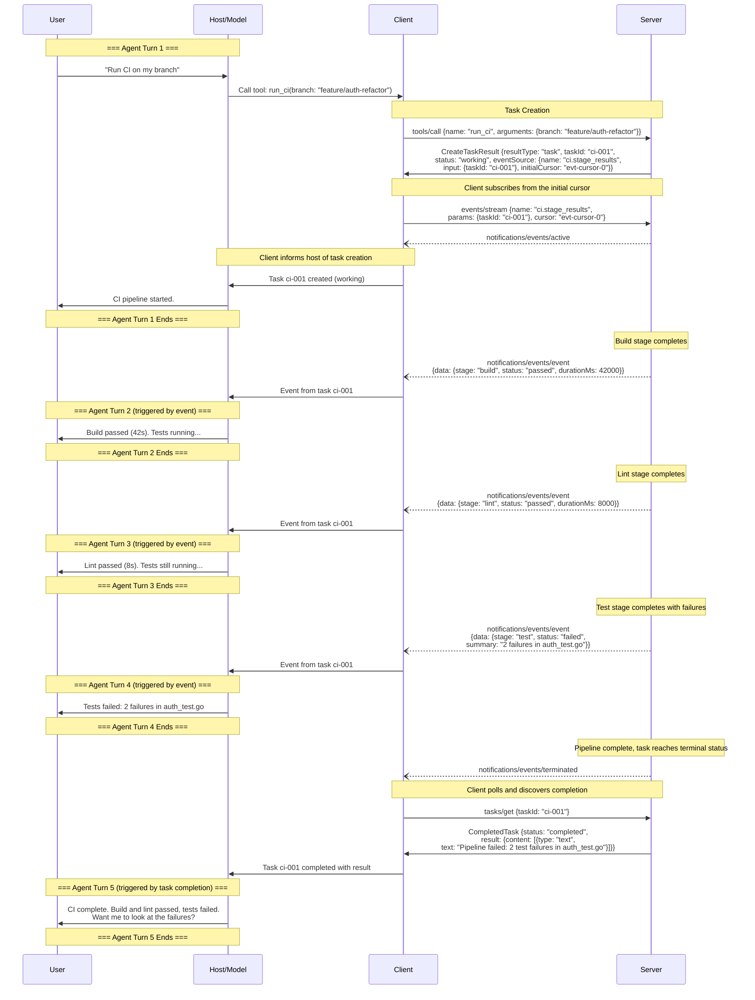
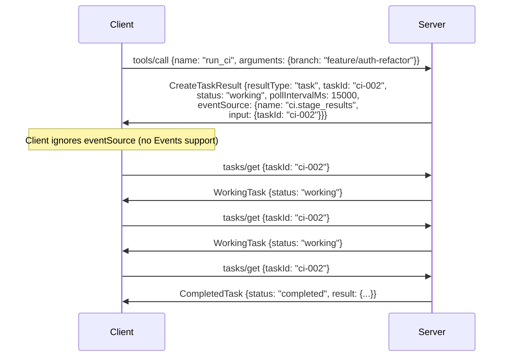

# SEP-XXXX: Task Event Sources

- **Status**: Draft
- **Type**: Standards Track
- **Created**: 2026-05-27
- **Author(s)**: Luca Chang (@LucaButBoring)
- **Sponsor**: None (seeking sponsor)
- **PR**: TBD

## Abstract

This SEP extends `CreateTaskResult` (defined by [SEP-2663](https://modelcontextprotocol.io/seps/2663-tasks-extension)) with an optional `eventSource` field that associates a task with an event stream from the [MCP Events](https://github.com/modelcontextprotocol/experimental-ext-triggers-events/blob/pja/design-sketch/docs/design-sketch-proposal.md) primitive. A client that receives a `CreateTaskResult` containing `eventSource` subscribes to the named event using the provided input parameters, receiving intermediate results routed to the model while the task executes in the background. The server terminates the event stream when the task reaches a terminal status.

## Motivation

[SEP-2663](https://modelcontextprotocol.io/seps/2663-tasks-extension) provides no mechanism for delivering intermediate output to the model during task execution. The model's only visibility into an in-progress task is the `statusMessage` field — a single optional string observable at poll time. For tasks executing over minutes to hours, the model cannot present partial findings, adjust its reasoning based on what has been discovered, or decide to cancel a task producing irrelevant results.

The [Events primitive](https://github.com/modelcontextprotocol/experimental-ext-triggers-events/blob/pja/design-sketch/docs/design-sketch-proposal.md) delivers typed, schema-validated event occurrences to clients, routed to an LLM for reasoning rather than processed programmatically by the host application. This proposal connects Events to Tasks: a server declares an event source on task creation, the client subscribes, and intermediate results flow to the model while the task executes.

The existing mechanisms in the Tasks extension cannot serve this purpose: `statusMessage` is a single unstructured string with no sequence semantics, no schema, and no replay; `inputRequests` carries blocking semantics (the task moves to `input_required` and halts until the client responds); and progress and logging notifications are explicitly prohibited on tasks by SEP-2663.

### Use Cases

**Deep Research.** A research task spawns sub-queries and produces intermediate findings over several minutes. The model cannot present partial results or refine its query based on early findings until the task completes. With an event source, each batch of findings reaches the model as it is produced.

**CI/CD Monitoring.** A task triggers a CI pipeline (build, lint, test, deploy) that runs for several minutes. The model cannot report which stage passed or failed until the entire pipeline finishes. With an event source, per-stage results arrive as each stage completes — the model can tell the user the build passed while tests are still running, or surface a lint failure immediately.

**Agent-to-Agent Delegation.** A task delegates work to another agent that reasons through multiple steps. The supervising model has no visibility into the delegated agent's progress. With an event source, the supervising model observes reasoning traces and can cancel the task if the delegated agent pursues an unproductive path.

## Specification

### Extension to `CreateTaskResult`

`CreateTaskResult` (as defined by [SEP-2663](https://modelcontextprotocol.io/seps/2663-tasks-extension): `type CreateTaskResult = Result & Task`) gains an optional `eventSource` field:

```typescript
interface CreateTaskResult extends Result, Task {
  // ... existing Task fields (taskId, status, ttlMs, pollIntervalMs, etc.)

  /**
   * An event source the client can subscribe to for intermediate results
   * from this task. The client subscribes using the Events primitive's
   * subscription interface with the provided name and input.
   */
  eventSource?: TaskEventSource;
}

interface TaskEventSource {
  /**
   * The event type name, as it appears in the server's events/list response.
   */
  name: string;

  /**
   * Input parameters for the event subscription, conforming to the event
   * type's inputSchema.
   */
  input: object;

  /**
   * An opaque cursor marking the event stream position at task creation.
   * The client passes this as the subscription cursor to replay events
   * emitted before it subscribed. Omitted when the event type does not
   * support replay, in which case the client subscribes from the current
   * position.
   */
  initialCursor?: string;
}
```

**Example Response:**

```json
{
  "jsonrpc": "2.0",
  "id": 1,
  "result": {
    "resultType": "task",
    "taskId": "786512e2-9e0d-44bd-8f29-789f320fe840",
    "status": "working",
    "createdAt": "2026-05-27T10:30:00Z",
    "lastUpdatedAt": "2026-05-27T10:30:00Z",
    "ttlMs": 3600000,
    "pollIntervalMs": 15000,
    "eventSource": {
      "name": "ci.stage_results",
      "input": {
        "taskId": "786512e2-9e0d-44bd-8f29-789f320fe840"
      },
      "initialCursor": "evt-cursor-0"
    }
  }
}
```

### Server Requirements

Servers **MUST NOT** include `eventSource` in `CreateTaskResult` unless the server and client have declared the Events capability. When a server includes `eventSource`:

1. The named event type **MUST** be resolvable via `events/list`.
2. The provided `input` **MUST** be valid according to the event type's `inputSchema`.
3. A client that subscribes with the provided `name` and `input` **MUST** receive events related to the associated task.
4. If the event type supports replay, the server **SHOULD** populate `initialCursor` with a cursor marking the stream position at task creation, so that a client subscribing with it does not miss events emitted before its subscription is established. The server **MUST** omit `initialCursor` for event types that do not support replay.

Servers **MAY** include `eventSource` on some task instances and omit it on others for the same tool, based on expected duration, arguments, or resource availability.

### Client Requirements

When a client receives a `CreateTaskResult` with `eventSource` defined:

1. The client **SHOULD** subscribe to the event source using the provided `name` and `input`, following the Events primitive's subscription semantics. If `initialCursor` is present, the client **SHOULD** subscribe with it as the cursor to replay events emitted before the subscription is established; otherwise the client subscribes from the current position.
2. If the client does not support Events or subscription fails, the client **MUST** continue polling via `tasks/get`.
3. The client **SHOULD** deliver received events to the model. The delivery mechanism is implementation-defined.
4. The client **MUST NOT** treat the event stream as a substitute for task status observation. Clients **MUST** continue observing task status via `tasks/get` or `notifications/tasks`.

The event stream and the task polling lifecycle are independent. A client may observe task completion via `tasks/get` before, after, or concurrently with receiving a stream termination signal.

### Event Delivery Semantics

Events delivered through a task event source **MUST** conform to the `EventOccurrence` schema defined by the Events primitive. The structure of the `data` field is governed by the event type's `payloadSchema`.

A task **MAY** emit zero events and complete normally.

### Stream Lifecycle

1. The server **MUST** terminate the event stream when the task reaches a terminal status (`completed`, `failed`, or `cancelled`). Termination uses the mechanism defined by the Events primitive for the active delivery mode.
2. The server **SHOULD** terminate the stream promptly. The server **MAY** drain events produced before the status transition but not yet transmitted, provided this period is brief.
3. Clients **SHOULD** cancel their subscription when they observe that the task has reached a terminal status, if they have not already received a termination signal.

### Interaction with Task Cancellation

If the client sends `tasks/cancel` for a task with an active event source subscription:

1. The server **SHOULD** terminate the event stream after the task transitions to a terminal status.
2. The client **MAY** cancel its subscription immediately upon sending `tasks/cancel`, without waiting for server-side termination.
3. Events received between sending `tasks/cancel` and observing termination are valid; the client **MAY** deliver them or discard them.

### Typical Convention

This specification does not mandate an event type naming convention. The expected common pattern is a task-scoped event type parameterized by `taskId`:

**Event type definition (from `events/list`):**

```json
{
  "name": "ci.stage_results",
  "description": "Per-stage results from a CI pipeline task.",
  "delivery": ["push", "poll"],
  "inputSchema": {
    "type": "object",
    "properties": {
      "taskId": {
        "type": "string",
        "description": "The task to subscribe to."
      }
    },
    "required": ["taskId"]
  },
  "payloadSchema": {
    "type": "object",
    "properties": {
      "stage": { "type": "string" },
      "status": { "type": "string", "enum": ["passed", "failed", "skipped"] },
      "durationMs": { "type": "integer" },
      "summary": { "type": "string" }
    },
    "required": ["stage", "status"]
  }
}
```

A server might expose a single generic `task.intermediate_results` event type or tool-specific types (e.g., `ci.stage_results`, `research.findings`) depending on whether intermediate results share a common structure across tools.

### Message Flow

#### Task with Event Source in an Agent Loop



#### Graceful Degradation (Client Without Events Support)



### Error Handling

**Subscription failure.** If subscription to the declared event source fails:

1. The client **MUST NOT** treat the subscription failure as a task failure.
2. The client **MUST** continue polling via `tasks/get`.
3. The client **SHOULD** log the failure. A subscription failure when the server declared `eventSource` indicates a server bug or a transient error.

**Unexpected stream termination.** If the event stream terminates before the client observes a terminal task status via `tasks/get`:

1. The client **MAY** resubscribe using the last known cursor.
2. The client **MUST** continue `tasks/get` polling regardless of stream state.
3. If resubscription fails, the client proceeds without intermediate results. The task lifecycle is unaffected.

**Race between stream termination and task completion.** Stream termination and the task reaching terminal status are causally related but not atomic from the client's perspective. A client may observe either first. Clients **MUST** handle both orderings.

## Rationale

### Why Not Move All Task Observation to Events?

Events exist to deliver occurrences that a model can reason about and act on. Task status transitions (`working` → `completed`) are not actionable by the model — they are infrastructure signals that the host application processes to drive its polling loop, retrieve a final result, or update UI. Delivering them as events introduces a class of event that the model cannot meaningfully respond to, contradicting the Events primitive's design intent. A proposal could carve out "application-only" events that the host intercepts before routing to the model, but this erodes the semantic clarity that makes Events useful in the first place: every event type now requires the client to decide whether it is model-directed or application-directed, and the Events primitive provides no mechanism for declaring this distinction.

Intermediate results are different: they are actionable by the model (it can present them to the user, adjust its reasoning, or decide to cancel), and they are not required for the task lifecycle to complete. Events carries content the model reasons about; task status remains an application concern the host handles via `tasks/get`.

### Does Coupling to Events Create an Undesirable Dependency?

Both the Tasks extension and Events are incubating. Coupling two unstable surfaces risks compounding breakage.

The dependency is purely additive. `eventSource` is optional — task creation, polling, completion, and cancellation work identically whether or not the field is present. A client that supports Tasks but not Events loses no functionality.

The coupling is shallow. This proposal does not extend or modify Events. It references Events' existing subscription interface (`name` + `params`). If that interface changes, only `TaskEventSource` and client subscription logic track the change; the Tasks extension itself is unaffected.

The alternative — a task-specific streaming mechanism — would duplicate subscription lifecycle, delivery mode negotiation, cursor management, and stream termination logic. Two independent streaming surfaces evolving in parallel would create a harder reconciliation problem than one shallow reference.

### Why Inline on `CreateTaskResult` Instead of Tool-Level or Separate Discovery?

**Tool-level declaration.** Event source availability is a per-task-instance decision, not a per-tool property. A server may emit intermediate results for some invocations but not others depending on arguments, expected duration, or resource availability. A tool-level declaration either forces the server to always stream (wasteful) or requires a "maybe present" qualifier the client cannot act on until it sees `CreateTaskResult` — at which point the declaration added nothing.

**Separate discovery method.** A `tasks/getEventSource` method adds a round-trip during which the task may have already emitted events. Unless the event type supports cursor-based replay (optional per the Events primitive), those events are lost. Inlining on `CreateTaskResult` eliminates this gap.

### Why `{ name, input }` Instead of a Pre-Created Subscription Handle?

A pre-created subscription couples the server to a specific delivery mode and removes client control. A client may prefer poll over push (serverless environments cannot hold connections open), or may want to manage cursor advancement differently. Returning `{ name, input }` maps directly to the Events subscription interface: the client calls `events/stream` or `events/poll` with the provided values, choosing its preferred delivery mode and managing its own cursor state.

## Backward Compatibility

This SEP introduces no backward incompatibilities:

- `eventSource` is an optional field on `CreateTaskResult`. Existing implementations that omit it continue to work unchanged.
- Clients that do not support Events ignore `eventSource` and poll via `tasks/get`.
- The task lifecycle (status transitions, `tasks/get`, `tasks/cancel`) is unaffected.
- No new extension identifiers are introduced.

Both the Tasks extension and the Events primitive are incubating. Incompatible changes to either would require updating `TaskEventSource` and client subscription logic but would not invalidate the overall approach of declaring an event source at task creation time.

## Security Implications

**Event stream as a second access surface for task data.** The task ID serves as a bearer token for accessing task state via `tasks/get`. This proposal introduces a second access path: the typical convention parameterizes the event source by `taskId`, so a client that knows the ID can subscribe. Servers **MUST** enforce the same authorization checks on event subscriptions as on `tasks/get`. If the server's Events implementation does not support per-subscription authorization, the server **MUST NOT** include `eventSource` on tasks with sensitive intermediate results, or **MUST** require a credential the server can validate independently of the task ID.

**Information disclosure via event payloads.** Intermediate results may contain data the server would not include in the final result (e.g., raw source material later summarized). Servers **SHOULD** apply the same data sensitivity controls to event payloads as to final task results.

**Resource exhaustion.** Each task with an event source adds a subscription to the server's event delivery infrastructure. A client creating many tasks in parallel multiplies connection and memory overhead. Servers **SHOULD** enforce limits on concurrent event subscriptions per client and terminate streams promptly when tasks reach terminal status.

**Event stream outliving task.** If the server discards a task (e.g., TTL expiry) but fails to terminate the associated stream, the client may continue receiving events for a nonexistent task. Clients **SHOULD** treat events for a task already observed in terminal status as stale and discard them.

## Reference Implementation

TBD
